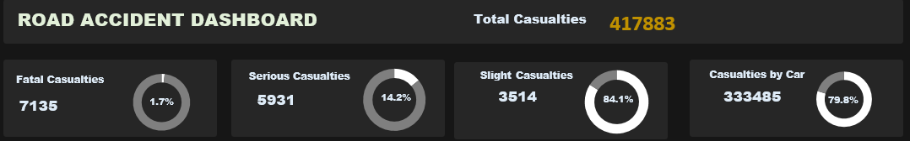
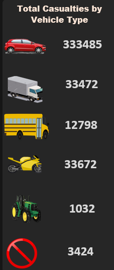
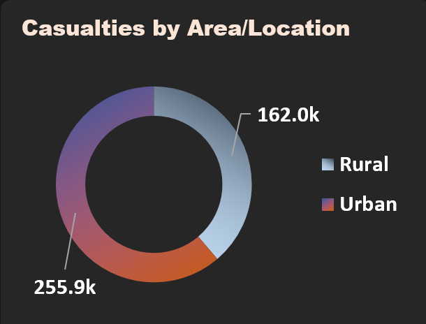
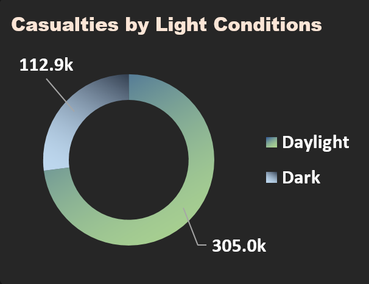
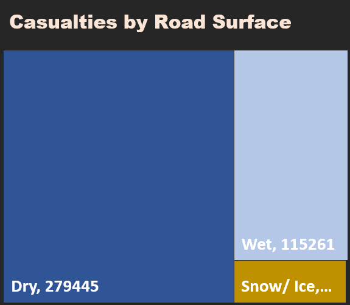

# Road-Accident-Report

 
***

## Introcution:
This is an Excel project on road accident analysis of an imaginary company. 
The project is to analyze and derive insights to answer crucial questions and help the company make data driven decisions.

**_Disclaimer_** : _All datasets and reports do not represent any company, institution or country, but just a dummy datasets to demonstrate capabilities of Excel_.

## Problem Statement
1. Primary KPI: Total casualties taken place after the accident
2. Primary KPI: Total casualties and percentage of total with respect to accident severity and maximum casualties by type of vehicle
3. Secondary KPI: Total casualties with respect to vehicle type
4. Monthly trend showing comparism of casualties for current and previous year
5. Maximum casualties by Road type
6. Distribution of total casualties by Road surface
7. Relation between casualties by Area/Location and by Day/Night

## Skills/ concepts demonstrated:

The following Excel features were incorporated:

- TEXT Function
- Pivot Table
- Filters
- Find and Replace
- Customized Column

## Stakaeholders
1. Ministry of transport
2. Road Transport Department
3. Police Force
4. Emergency Service Department
5. Road safety corps
6. Transport Operators
7. Traffic Management Agencies
8. Public
9. Media

## Metadata

File Extension: .xlsx
Number of Rows: 307,974
Number of Fields: 23

## Visualization: 
The report comprises of 2 pages:
1. The Database
2. The Dashboard
   
You can interact with the report [here](https://docs.google.com/spreadsheets/d/1j2FH4wTzK03n0EIDFbwOglUSb4hqZAS8/edit?usp=sharing&ouid=112520287571171477298&rtpof=true&sd=true)

## Analysis

### Total Casualties

- A total number of **417883** casualties was recorded
- 1.7% of those total casualties was fatal
- 14.2% were serious
- 84.1% was slight

## Total Casualties by vehicle type

- Highest casualties by vehcle type was car with a total of 333485 number of casualties
- Lowest casualties by vehicle type was agricultural vehicle with a total of 1032 number of casualties

## Total casualties by Area/Location

- Urban areas had more casualties than the rural areas.
- Urban areas recorded a total number of 255,9000 while rural area recorded a total number of 162,000 % of the total casualties

## Total casualties by Light condition

- More accident occured durring the day (305,000) than in the night (112,900)

## Total casualties by road surface
 
- Dry: 2779445 casualties
- Wet: 115261 casualties
- Snow/ice: 22781 casualties
- Others: 396 casualties
